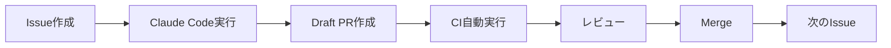

# Kagura AI 2.0 開発ロードマップ - Claude Code駆動開発

## 前提条件

- **既存Issue**: 全てクローズし、新規開始
- **開発手法**: Issue-Driven AI Development (ai_docs/参照)
- **開発ツール**: Claude Code で全て実装
- **最終ゴール**: PyPI パッケージリリース (kagura-ai v2.0.0)

---

## 開発フローの原則

### Issue作成 → Claude Code実行 → Draft PR → Review → Merge



### Issue命名規則

```
[CORE-001] Implement @agent decorator
[EXEC-001] Create CodeExecutor with AST validation
[CLI-001] Implement kagura repl command
[TEST-001] Add unit tests for @agent decorator
[DOC-001] Write Getting Started guide
```

---

## Phase 0: 準備・環境整備 (Week 1)

### Issue #0-1: プロジェクトクリーンアップ

**タイトル**: `[SETUP-001] Clean up legacy code and close old issues`

**内容**:
```markdown
## 🎯 目的
Kagura AI 2.0開発のための環境整備

## 📋 Claude Code用タスク定義

1. 既存Issue (#1-8) を全てクローズ
   - クローズコメント: "Superseded by Kagura AI 2.0 redesign"

2. レガシーコードの整理
   - `src/kagura/` 配下を `src/kagura_legacy/` に移動
   - 新しい `src/kagura/` ディレクトリを作成

3. 開発ブランチの作成
   - `develop/v2.0` ブランチ作成
   - 以降の開発はこのブランチで実施

4. pyproject.toml の更新
   - version = "2.0.0-alpha.1"
   - 不要な依存関係を削除

## ✅ 完了条件
- [ ] 既存Issue全てクローズ
- [ ] レガシーコード移動完了
- [ ] `develop/v2.0` ブランチ作成
- [ ] pyproject.toml更新
```

### Issue #0-2: 最小限のプロジェクト構造作成

**タイトル**: `[SETUP-002] Create minimal project structure for v2.0`

**内容**:
```markdown
## 🎯 目的
Kagura AI 2.0の基本ディレクトリ構造を作成

## 📂 スコープ境界
**許可パス**:
- `src/kagura/` (新規作成)
- `tests/` (リセット)
- `pyproject.toml`

## 📋 Claude Code用タスク定義

1. 新しいディレクトリ構造を作成
```
src/kagura/
├── __init__.py
├── core/
│   ├── __init__.py
│   ├── decorators.py     # @agent, @tool, @workflow
│   ├── executor.py       # CodeExecutor
│   ├── llm.py           # LLM統合
│   └── parser.py        # 型ベースパース
├── cli/
│   ├── __init__.py
│   └── main.py
└── version.py

tests/
├── __init__.py
├── core/
│   ├── test_decorators.py
│   └── test_executor.py
└── conftest.py
```

2. 各__init__.pyに最小限のエクスポート設定

3. pyproject.tomlの更新
   - 最小限の依存関係のみ
   ```toml
   dependencies = [
       "pydantic>=2.10",
       "litellm>=1.53",
       "jinja2>=3.1",
       "click>=8.1",
   ]
   ```

## ✅ 完了条件
- [ ] ディレクトリ構造作成完了
- [ ] 全ての__init__.py作成
- [ ] pyproject.toml更新
- [ ] `uv sync` が成功
```

---

## Phase 1: Core Engine (Week 2-4)

### Issue #1-1: @agentデコレータ実装

**タイトル**: `[CORE-001] Implement @agent decorator with basic LLM integration`

**内容**:
```markdown
## 🎯 目的
関数を自動的にAIエージェントに変換する@agentデコレータの実装

## 📂 スコープ境界
**許可パス**:
- `src/kagura/core/decorators.py`
- `src/kagura/core/llm.py`
- `src/kagura/core/parser.py`
- `tests/core/test_decorators.py`

## 📋 Claude Code用タスク定義

1. `decorators.py` の実装
   - `@agent` デコレータ
   - 関数シグネチャの解析
   - docstringからプロンプト生成

2. `llm.py` の実装
   - LiteLLM統合
   - 基本的なLLM呼び出し
   - エラーハンドリング

3. `parser.py` の実装
   - 戻り値の型に基づく自動パース
   - str, int, float, list, dict対応
   - Pydanticモデル対応

4. テストの作成
   - 基本的なエージェント実行テスト
   - 型パーステスト
   - エラーハンドリングテスト

## 📝 実装例

```python
# src/kagura/core/decorators.py
from typing import TypeVar, Callable, ParamSpec, Awaitable
from functools import wraps
import inspect

P = ParamSpec('P')
T = TypeVar('T')

def agent(
    fn: Callable[P, Awaitable[T]] = None,
    *,
    model: str = "gpt-4o-mini",
    temperature: float = 0.7,
    **kwargs
) -> Callable[P, Awaitable[T]]:
    """Convert a function into an AI agent"""
    def decorator(func: Callable[P, Awaitable[T]]) -> Callable[P, Awaitable[T]]:
        sig = inspect.signature(func)
        doc = inspect.getdoc(func) or ""

        @wraps(func)
        async def wrapper(*args: P.args, **kwargs: P.kwargs) -> T:
            from .llm import LLM
            from .parser import parse_response
            from .prompt import build_prompt

            # 引数バインド
            bound = sig.bind(*args, **kwargs)
            bound.apply_defaults()

            # プロンプト生成
            prompt = build_prompt(doc, bound.arguments)

            # LLM呼び出し
            llm = LLM(model=model, temperature=temperature)
            response = await llm.generate(prompt)

            # パース
            return parse_response(response, sig.return_annotation)

        wrapper._is_agent = True
        wrapper._model = model
        return wrapper

    return decorator if fn is None else decorator(fn)
```

## 🧾 コミット規約
```
feat(core): implement @agent decorator (#1-1)
test(core): add tests for @agent decorator (#1-1)
docs(core): document @agent decorator usage (#1-1)
```

## ✅ 完了条件
- [ ] @agentデコレータ実装完了
- [ ] LLM統合動作確認
- [ ] 型ベースパース実装
- [ ] ユニットテストカバレッジ90%+
- [ ] 以下のコードが動作する:
```python
@agent
async def hello(name: str) -> str:
    '''Say hello to {{ name }}'''
    pass

result = await hello("World")
assert "World" in result
```
```

### Issue #1-2: プロンプトテンプレートエンジン

**タイトル**: `[CORE-002] Implement Jinja2-based prompt template engine`

**内容**:
```markdown
## 🎯 目的
docstringをJinja2テンプレートとして扱い、引数を埋め込む機能

## 📂 スコープ境界
**許可パス**:
- `src/kagura/core/prompt.py`
- `tests/core/test_prompt.py`

## 📋 Claude Code用タスク定義

1. `prompt.py` の実装
   - Jinja2統合
   - 変数埋め込み
   - エスケープ処理

2. テスト作成
   - 基本的なテンプレート展開
   - 複雑な変数(dict, list)の埋め込み
   - エラーケース

## ✅ 完了条件
- [ ] Jinja2統合完了
- [ ] テストカバレッジ90%+
- [ ] 以下のコードが動作:
```python
@agent
async def translate(text: str, lang: str = "ja") -> str:
    '''Translate to {{ lang }}: {{ text }}'''
    pass
```
```

### Issue #1-3: 型ベースレスポンスパース

**タイトル**: `[CORE-003] Implement type-based response parsing for complex types`

**内容**:
```markdown
## 🎯 目的
Pydanticモデル、list[T]、dict等の複雑な型のパース

## 📂 スコープ境界
**許可パス**:
- `src/kagura/core/parser.py`
- `tests/core/test_parser.py`

## 📋 Claude Code用タスク定義

1. `parser.py` の拡張
   - Pydanticモデルのパース
   - list[T]のパース
   - Optional[T]のパース
   - Union型のパース

2. JSON Schemaの生成
   - Pydanticモデル → JSON Schema
   - LLMに渡してStructured Output

## ✅ 完了条件
- [ ] 複雑な型のパース実装
- [ ] JSON Schema生成
- [ ] 以下のコードが動作:
```python
from pydantic import BaseModel

class Person(BaseModel):
    name: str
    age: int

@agent
async def extract_person(text: str) -> Person:
    '''Extract person info from: {{ text }}'''
    pass
```
```

---

## Phase 2: Code Execution (Week 5-6)

### Issue #2-1: CodeExecutor実装

**タイトル**: `[EXEC-001] Implement safe code executor with AST validation`

**内容**:
```markdown
## 🎯 目的
安全なPythonコード実行エンジンの実装

## 📂 スコープ境界
**許可パス**:
- `src/kagura/core/executor.py`
- `src/kagura/core/sandbox.py`
- `tests/core/test_executor.py`

## 📋 Claude Code用タスク定義

1. `executor.py` の実装
   - AST解析によるバリデーション
   - Import制限
   - 関数制限
   - タイムアウト
   - 出力キャプチャ

2. `sandbox.py` の実装
   - リソース制限
   - メモリ制限
   - CPU時間制限

3. セキュリティテスト
   - 危険なコードの検出
   - Import制限のテスト
   - タイムアウトのテスト

## 🛡️ セキュリティ要件
- [ ] os, sys, subprocess等のimport禁止
- [ ] exec, eval, open等の関数禁止
- [ ] タイムアウト: デフォルト30秒
- [ ] メモリ制限: デフォルト512MB

## ✅ 完了条件
- [ ] CodeExecutor実装完了
- [ ] セキュリティテスト全てパス
- [ ] 以下のコードが動作:
```python
executor = CodeExecutor()
result = await executor.execute('''
import math
result = math.sqrt(16)
''')
assert result["success"] == True
assert result["result"] == 4.0
```
```

### Issue #2-2: Code実行エージェント

**タイトル**: `[EXEC-002] Implement code execution agent`

**内容**:
```markdown
## 🎯 目的
コード生成→実行を自動化するエージェント

## 📂 スコープ境界
**許可パス**:
- `src/kagura/agents/code_executor.py`
- `tests/agents/test_code_executor.py`

## 📋 Claude Code用タスク定義

1. `code_executor.py` の実装
   - @agent(execute_code=True)デコレータ
   - コード生成→実行パイプライン
   - エラーハンドリング

2. テストの作成
   - 基本的な計算タスク
   - 外部ライブラリ使用
   - エラーケース

## ✅ 完了条件
- [ ] 実装完了
- [ ] 以下のコードが動作:
```python
from kagura.agents import execute_code

result = await execute_code("Calculate fibonacci(10)")
assert result["success"] == True
assert result["result"] == 55
```
```

---

## Phase 3: CLI & REPL (Week 7-8)

### Issue #3-1: CLIフレームワーク

**タイトル**: `[CLI-001] Implement CLI framework with Click`

**内容**:
```markdown
## 🎯 目的
kagura コマンドのCLIフレームワーク

## 📂 スコープ境界
**許可パス**:
- `src/kagura/cli/`
- `tests/cli/`

## 📋 Claude Code用タスク定義

1. `cli/main.py` の実装
   - Click統合
   - サブコマンド構造
   - --version, --help

2. 基本コマンド
   - `kagura version`
   - `kagura run <agent_file>`

## ✅ 完了条件
- [ ] CLI実行可能
- [ ] `kagura --version` 動作
```

### Issue #3-2: REPL実装

**タイトル**: `[CLI-002] Implement interactive REPL`

**内容**:
```markdown
## 🎯 目的
kagura repl コマンドの実装

## 📂 スコープ境界
**許可パス**:
- `src/kagura/cli/repl.py`
- `tests/cli/test_repl.py`

## 📋 Claude Code用タスク定義

1. `repl.py` の実装
   - マルチライン入力
   - エージェント定義機能
   - コマンド実行(/help, /agents, /exit)
   - 履歴機能

2. Rich統合
   - シンタックスハイライト
   - テーブル表示
   - プログレスバー

## ✅ 完了条件
- [ ] `kagura repl` 起動
- [ ] エージェント定義・実行可能
- [ ] コマンド動作
```

---

## Phase 4: 統合・テスト (Week 9-10)

### Issue #4-1: 統合テスト

**タイトル**: `[TEST-001] Add end-to-end integration tests`

### Issue #4-2: ドキュメント

**タイトル**: `[DOC-001] Write comprehensive documentation`

### Issue #4-3: サンプルコード

**タイトル**: `[DOC-002] Create example agents`

---

## Phase 5: パッケージング・リリース (Week 11-12)

### Issue #5-1: パッケージング

**タイトル**: `[RELEASE-001] Prepare package for PyPI release`

**内容**:
```markdown
## 🎯 目的
PyPIリリースの準備

## 📋 Claude Code用タスク定義

1. pyproject.toml の最終調整
   - メタデータ完備
   - 依存関係確定
   - classifiers設定

2. README.md の更新
   - インストール方法
   - クイックスタート
   - 使用例

3. CHANGELOG.md の作成

4. LICENSE確認

## ✅ 完了条件
- [ ] pyproject.toml完成
- [ ] README.md完成
- [ ] CHANGELOG.md作成
- [ ] `uv build` 成功
```

### Issue #5-2: PyPIリリース

**タイトル**: `[RELEASE-002] Release v2.0.0 to PyPI`

**内容**:
```markdown
## 🎯 目的
PyPIへの公開

## 📋 Claude Code用タスク定義

1. テストPyPIへのアップロード
   ```bash
   uv publish --repository testpypi
   ```

2. 動作確認
   ```bash
   pip install -i https://test.pypi.org/simple/ kagura-ai==2.0.0
   ```

3. 本番PyPIへのアップロード
   ```bash
   uv publish
   ```

4. GitHubリリースの作成
   - タグ: v2.0.0
   - リリースノート

## ✅ 完了条件
- [ ] PyPI公開完了
- [ ] `pip install kagura-ai` で動作確認
- [ ] GitHubリリース作成
```

---

## Issue作成順序

### Week 1: 準備
1. `[SETUP-001]` プロジェクトクリーンアップ
2. `[SETUP-002]` プロジェクト構造作成

### Week 2-4: Core
3. `[CORE-001]` @agentデコレータ
4. `[CORE-002]` プロンプトテンプレート
5. `[CORE-003]` 型ベースパース

### Week 5-6: Executor
6. `[EXEC-001]` CodeExecutor
7. `[EXEC-002]` Code実行エージェント

### Week 7-8: CLI
8. `[CLI-001]` CLIフレームワーク
9. `[CLI-002]` REPL

### Week 9-10: 統合
10. `[TEST-001]` 統合テスト
11. `[DOC-001]` ドキュメント
12. `[DOC-002]` サンプルコード

### Week 11-12: リリース
13. `[RELEASE-001]` パッケージング
14. `[RELEASE-002]` PyPI公開

---

## 成功指標

### 技術的指標
- [ ] テストカバレッジ 90%+
- [ ] 型安全性 100% (pyright strict)
- [ ] ドキュメント完備

### 機能的指標
- [ ] 5行でエージェント作成可能
- [ ] コード実行機能動作
- [ ] REPL起動・動作

### リリース指標
- [ ] PyPI公開完了
- [ ] `pip install kagura-ai` で動作
- [ ] README のサンプルコード全て動作

---

## 次のアクション

### 今すぐ実施
1. **Issue #0-1 作成**: プロジェクトクリーンアップ
2. **Claude Codeで実行**: Issue #0-1
3. **Draft PR作成**: レビュー依頼

### Week 1以降
4. Issue #0-2 → Claude Code実行
5. Phase 1 開始

---

## 参考ドキュメント

- `ai_docs/SETUP_GUIDE.md` - 開発環境セットアップ
- `ai_docs/coding_standards.md` - コーディング規約
- `.github/ISSUE_TEMPLATE/claude_*.md` - Issue テンプレート
