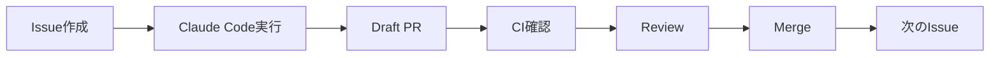

# Kagura AI 2.0 開発の始め方

## 🚀 開発開始手順

### ステップ1: 最初のIssueを作成

```bash
# GitHubでIssue作成
# タイトル: [SETUP-001] Clean up legacy code and close old issues
# 内容: ai_docs/issues/SETUP-001-cleanup.md の内容をコピペ
```

または、GitHub CLIで:

```bash
gh issue create \
  --title "[SETUP-001] Clean up legacy code and close old issues" \
  --label "claude-code,setup" \
  --body-file ai_docs/issues/SETUP-001-cleanup.md
```

### ステップ2: Claude Codeで実行

```bash
# Claude Codeを起動
claude code

# プロンプト:
「GitHub Issue #[番号] を読み込んで、タスクを実行してください」
```

### ステップ3: 結果確認

Claude Codeが自動で:
1. ブランチ作成
2. コード変更
3. コミット
4. Draft PR作成

### ステップ4: レビュー・マージ

```bash
# PR確認
gh pr list

# CIステータス確認
gh pr checks [PR番号]

# レビュー後、マージ
gh pr ready [PR番号]  # Draftを解除
gh pr merge [PR番号] --squash
```

### ステップ5: 次のIssueへ

```bash
# 次のIssue作成
gh issue create \
  --title "[SETUP-002] Create minimal project structure for v2.0" \
  --label "claude-code,setup" \
  --body-file ai_docs/issues/SETUP-002-structure.md

# Claude Codeで実行
claude code
# 「GitHub Issue #[番号] を読み込んで実行してください」
```

---

## 📋 開発フロー



---

## 📂 Issue管理

### Phase 0: 準備 (Week 1)

- [x] `ai_docs/issues/SETUP-001-cleanup.md` - 作成済み
- [x] `ai_docs/issues/SETUP-002-structure.md` - 作成済み

### Phase 1: Core Engine (Week 2-4)

- [ ] `[CORE-001]` Implement @agent decorator
- [ ] `[CORE-002]` Implement prompt template engine
- [ ] `[CORE-003]` Implement type-based response parsing

### Phase 2: Code Execution (Week 5-6)

- [ ] `[EXEC-001]` Implement CodeExecutor
- [ ] `[EXEC-002]` Implement code execution agent

### Phase 3: CLI & REPL (Week 7-8)

- [ ] `[CLI-001]` Implement CLI framework
- [ ] `[CLI-002]` Implement REPL

### Phase 4: 統合・テスト (Week 9-10)

- [ ] `[TEST-001]` Add integration tests
- [ ] `[DOC-001]` Write documentation
- [ ] `[DOC-002]` Create examples

### Phase 5: リリース (Week 11-12)

- [ ] `[RELEASE-001]` Prepare package
- [ ] `[RELEASE-002]` Release to PyPI

---

## 🎯 マイルストーン

### M0: 環境準備 (Week 1)
- [ ] SETUP-001: クリーンアップ
- [ ] SETUP-002: プロジェクト構造

### M1: 基本機能 (Week 2-4)
- [ ] @agentデコレータ動作
- [ ] 型ベースパース動作
- [ ] 最低限のLLM統合

### M2: コード実行 (Week 5-6)
- [ ] CodeExecutor動作
- [ ] execute_code エージェント動作

### M3: CLI (Week 7-8)
- [ ] kagura --version 動作
- [ ] kagura repl 動作

### M4: リリース準備 (Week 9-10)
- [ ] 統合テスト全てパス
- [ ] ドキュメント完成

### M5: PyPI公開 (Week 11-12)
- [ ] pip install kagura-ai で動作

---

## 🔧 開発環境

### 必須ツール

```bash
# UV (パッケージマネージャ)
curl -LsSf https://astral.sh/uv/install.sh | sh

# GitHub CLI
brew install gh  # macOS
# または https://cli.github.com/

# Claude Code
# https://docs.claude.com/en/docs/claude-code
```

### セットアップ

```bash
# 依存関係インストール
uv sync
uv pip install -e ".[dev]"

# pre-commit設定
pre-commit install
```

### 開発コマンド

```bash
# 型チェック
make right
# または
uv run pyright src/kagura

# リント
make ruff
# または
uv run ruff check src/kagura

# テスト
make test
# または
uv run pytest tests/

# 全チェック
make check
```

---

## 📝 Issue作成のコツ

### 良いIssue

```markdown
## 🎯 目的
明確な目的を1文で

## 📂 スコープ境界
変更して良いファイル・禁止ファイルを明記

## 📋 Claude Code用タスク定義
具体的な手順をステップバイステップで

## ✅ 完了条件
チェックリスト形式で明確に
```

### 悪いIssue

```markdown
エージェントを作る
```

---

## 🚨 トラブルシューティング

### Claude Codeがエラーを起こす

1. **Issueの指示を明確にする**
   - スコープ境界を明示
   - 禁止パスを指定

2. **ai_docs/を参照させる**
   - `ai_docs/coding_standards.md`を参照
   - `ai_docs/architecture.md`を参照

3. **段階的に進める**
   - 大きなタスクは分割
   - 1 Issue = 1 PR

### CIが失敗する

```bash
# ローカルで確認
make ruff
make right
make test

# 修正後、再プッシュ
git commit --amend
git push --force-with-lease
```

### マージコンフリクト

```bash
# mainから最新を取得
git checkout main
git pull origin main

# 作業ブランチをリベース
git checkout feature/XXX
git rebase main

# コンフリクト解決後
git push --force-with-lease
```

---

## 📖 参考ドキュメント

- `ai_docs/DEVELOPMENT_ROADMAP.md` - 全体計画
- `ai_docs/SETUP_GUIDE.md` - 環境セットアップ
- `ai_docs/coding_standards.md` - コーディング規約
- `ai_docs/architecture.md` - アーキテクチャ
- `ai_docs/glossary.md` - 用語集

---

## 🎓 次のステップ

### 今すぐ実施

1. **Issue #SETUP-001を作成**
   ```bash
   gh issue create \
     --title "[SETUP-001] Clean up legacy code and close old issues" \
     --label "claude-code,setup" \
     --body-file ai_docs/issues/SETUP-001-cleanup.md
   ```

2. **Claude Codeで実行**
   ```bash
   claude code
   # 「GitHub Issue #[番号]を読み込んで実行」
   ```

3. **結果確認・マージ**

### Week 1以降

4. Issue #SETUP-002を作成・実行
5. Phase 1 (Core Engine) 開始

---

**準備完了！開発を始めましょう！** 🚀
