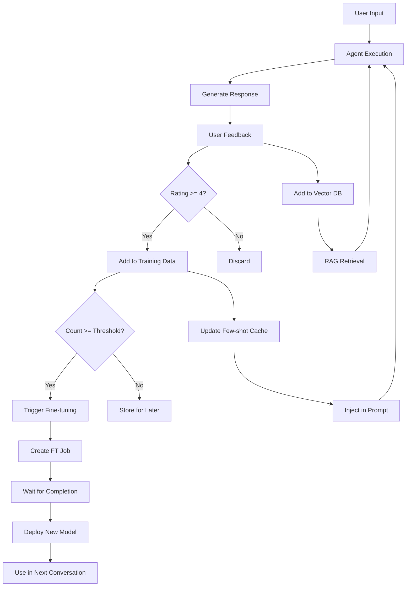

# RFC-003: Personal AI Assistant with Auto Fine-tuning

**ステータス**: 提案中
**作成日**: 2025-10-03
**対象バージョン**: v2.3.0 - v2.4.0
**関連Issue**: #63

---

## 📋 概要

**使えば使うほど賢くなる、あなた専属のパーソナルAIアシスタント**

会話データを自動収集し、定期的にLLMをファインチューニング（FT）することで、ユーザー固有の知識・話し方・好みを継続的に学習します。

---

## 🎯 目標

### ユーザー視点

- ✅ 自分の好みを理解したアシスタント
- ✅ 過去の会話を記憶
- ✅ 使うほど精度が向上
- ✅ プライバシー保護（ローカルオプション）
- ✅ シンプルな操作（自動化）

### 技術的目標

- ✅ RAG + Few-shot + Fine-tuningの3段階学習
- ✅ OpenAI/Gemini FT API統合
- ✅ ローカルLoRA FT対応（オプション）
- ✅ プライバシーフィルター
- ✅ コスト管理機能

---

## 🏗️ アーキテクチャ

### 3段階パーソナライゼーション

```
Level 1: RAG (即座の記憶)
  ↓
  すべての会話をベクトルDBに保存
  関連する過去の会話を即座に参照
  効果: 即座に反映

Level 2: Few-shot Learning (短期学習)
  ↓
  高評価の会話をプロンプトに埋め込み
  最新10-20件を動的にfew-shot examplesとして使用
  効果: 数回の会話で反映

Level 3: Fine-tuning (長期学習)
  ↓
  100件以上の高評価データでFT
  ユーザー固有のモデル作成
  効果: 根本的な知識・話し方を学習
```

### データフロー



---

## 💻 実装詳細

### 1. コアシステム

#### データコレクター

```python
# src/kagura/personalize/collector.py
import aiosqlite
import json
from datetime import datetime
from pathlib import Path

class ConversationCollector:
    """会話データの自動収集"""

    def __init__(self, user_id: str, storage_dir: str = ".kagura/data"):
        self.user_id = user_id
        self.storage_dir = Path(storage_dir) / user_id
        self.storage_dir.mkdir(parents=True, exist_ok=True)
        self.db_path = self.storage_dir / "conversations.db"

    async def initialize(self):
        """DB初期化"""
        async with aiosqlite.connect(self.db_path) as db:
            await db.execute("""
                CREATE TABLE IF NOT EXISTS conversations (
                    id INTEGER PRIMARY KEY AUTOINCREMENT,
                    timestamp TEXT NOT NULL,
                    messages TEXT NOT NULL,
                    response TEXT NOT NULL,
                    model TEXT,
                    rating INTEGER,
                    feedback TEXT,
                    metadata TEXT,
                    used_for_ft BOOLEAN DEFAULT 0
                )
            """)
            await db.commit()

    async def collect(
        self,
        messages: list[dict],
        response: str,
        model: str,
        metadata: dict = None
    ) -> int:
        """会話データを収集

        Args:
            messages: 会話履歴
            response: AIの応答
            model: 使用モデル
            metadata: メタデータ

        Returns:
            conversation_id
        """
        async with aiosqlite.connect(self.db_path) as db:
            cursor = await db.execute(
                """INSERT INTO conversations
                   (timestamp, messages, response, model, metadata)
                   VALUES (?, ?, ?, ?, ?)""",
                (
                    datetime.now().isoformat(),
                    json.dumps(messages, ensure_ascii=False),
                    response,
                    model,
                    json.dumps(metadata or {}, ensure_ascii=False)
                )
            )
            await db.commit()
            return cursor.lastrowid

    async def add_feedback(
        self,
        conversation_id: int,
        rating: int,
        comment: str = None
    ):
        """フィードバックを追加

        Args:
            conversation_id: 会話ID
            rating: 評価 (1-5)
            comment: コメント
        """
        async with aiosqlite.connect(self.db_path) as db:
            await db.execute(
                """UPDATE conversations
                   SET rating = ?, feedback = ?
                   WHERE id = ?""",
                (rating, comment, conversation_id)
            )
            await db.commit()

    async def get_training_data(
        self,
        min_rating: int = 4,
        limit: int = None
    ) -> list[dict]:
        """FT用データ取得

        Args:
            min_rating: 最低評価
            limit: 件数制限

        Returns:
            学習データリスト
        """
        query = """
            SELECT messages, response, rating
            FROM conversations
            WHERE rating >= ? AND used_for_ft = 0
            ORDER BY timestamp DESC
        """

        if limit:
            query += f" LIMIT {limit}"

        async with aiosqlite.connect(self.db_path) as db:
            async with db.execute(query, (min_rating,)) as cursor:
                rows = await cursor.fetchall()

        return [
            {
                "messages": json.loads(row[0]),
                "response": row[1],
                "rating": row[2]
            }
            for row in rows
        ]

    async def get_stats(self) -> dict:
        """統計情報取得"""
        async with aiosqlite.connect(self.db_path) as db:
            total = await db.execute_fetchall(
                "SELECT COUNT(*) FROM conversations"
            )
            rated = await db.execute_fetchall(
                "SELECT COUNT(*) FROM conversations WHERE rating IS NOT NULL"
            )
            high_rated = await db.execute_fetchall(
                "SELECT COUNT(*) FROM conversations WHERE rating >= 4"
            )
            used_for_ft = await db.execute_fetchall(
                "SELECT COUNT(*) FROM conversations WHERE used_for_ft = 1"
            )

        return {
            "total": total[0][0],
            "rated": rated[0][0],
            "high_rated": high_rated[0][0],
            "ready_for_ft": high_rated[0][0] - used_for_ft[0][0]
        }
```

#### プライバシーフィルター

```python
# src/kagura/personalize/privacy.py
import re
from typing import Any

class PrivacyFilter:
    """個人情報検出・除外"""

    # 正規表現パターン
    PATTERNS = {
        "email": r"\b[A-Z0-9._%+-]+@[A-Z0-9.-]+\.[A-Z]{2,}\b",
        "phone_jp": r"\d{2,4}-\d{2,4}-\d{4}",
        "phone_intl": r"\+\d{1,3}[-\s]?\d{1,4}[-\s]?\d{1,4}[-\s]?\d{1,4}",
        "credit_card": r"\d{4}[-\s]?\d{4}[-\s]?\d{4}[-\s]?\d{4}",
        "ssn": r"\d{3}-\d{2}-\d{4}",
    }

    def __init__(
        self,
        detect_pii: bool = True,
        anonymize: bool = True,
        custom_patterns: dict[str, str] = None
    ):
        self.detect_pii = detect_pii
        self.anonymize = anonymize

        if custom_patterns:
            self.PATTERNS.update(custom_patterns)

    def scan(self, text: str) -> dict[str, list[str]]:
        """個人情報をスキャン

        Args:
            text: スキャン対象テキスト

        Returns:
            検出された個人情報の辞書
        """
        found = {}

        for name, pattern in self.PATTERNS.items():
            matches = re.findall(pattern, text, re.IGNORECASE)
            if matches:
                found[name] = matches

        return found

    def filter(self, text: str) -> tuple[str, bool]:
        """個人情報をフィルタリング

        Args:
            text: フィルタリング対象

        Returns:
            (フィルタ後テキスト, 個人情報が含まれていたか)
        """
        found = self.scan(text)

        if not found:
            return text, False

        if self.anonymize:
            # 匿名化
            filtered = text
            for pii_type, matches in found.items():
                for match in matches:
                    filtered = filtered.replace(match, f"[REDACTED_{pii_type.upper()}]")
            return filtered, True
        else:
            # 除外（空文字列）
            return "", True

    def is_safe(self, data: dict) -> bool:
        """データが安全か判定

        Args:
            data: チェック対象データ

        Returns:
            安全ならTrue
        """
        # messagesとresponseをチェック
        for msg in data.get("messages", []):
            content = msg.get("content", "")
            if self.scan(content):
                return False

        response = data.get("response", "")
        if self.scan(response):
            return False

        return True
```

#### Fine-tuning Manager

```python
# src/kagura/personalize/finetune.py
from openai import OpenAI
import asyncio
import json

class OpenAIFinetune:
    """OpenAI Fine-tuning管理"""

    def __init__(
        self,
        user_id: str,
        base_model: str = "gpt-4o-mini-2024-07-18",
        api_key: str = None
    ):
        self.user_id = user_id
        self.base_model = base_model
        self.client = OpenAI(api_key=api_key)
        self.jobs_file = f".kagura/data/{user_id}/ft_jobs.json"

    async def prepare_training_data(
        self,
        conversations: list[dict],
        output_path: str = None
    ) -> str:
        """学習データをOpenAI形式に変換

        Args:
            conversations: 会話データ
            output_path: 出力先

        Returns:
            ファイルパス
        """
        if not output_path:
            output_path = f".kagura/data/{self.user_id}/training_data.jsonl"

        with open(output_path, 'w', encoding='utf-8') as f:
            for conv in conversations:
                training_example = {
                    "messages": conv["messages"] + [
                        {"role": "assistant", "content": conv["response"]}
                    ]
                }
                f.write(json.dumps(training_example, ensure_ascii=False) + '\n')

        return output_path

    async def estimate_cost(self, training_file: str) -> dict:
        """コスト見積もり

        Args:
            training_file: 学習データファイル

        Returns:
            コスト情報
        """
        # トークン数カウント
        total_tokens = 0
        with open(training_file, 'r') as f:
            for line in f:
                data = json.loads(line)
                # 簡易的なトークン推定（実際はtiktokenを使用）
                for msg in data['messages']:
                    total_tokens += len(msg['content'].split()) * 1.3

        # コスト計算（2024年10月時点の価格）
        # gpt-4o-mini: $0.30/1M tokens (training)
        training_cost = (total_tokens / 1_000_000) * 0.30

        return {
            "total_tokens": int(total_tokens),
            "estimated_cost_usd": round(training_cost, 2),
            "estimated_time_minutes": 15  # 固定値（実際は可変）
        }

    async def start_finetuning(
        self,
        training_file: str,
        validation_file: str = None,
        hyperparameters: dict = None
    ) -> str:
        """Fine-tuning開始

        Args:
            training_file: 学習データ
            validation_file: 検証データ
            hyperparameters: ハイパーパラメータ

        Returns:
            Job ID
        """
        # ファイルアップロード
        with open(training_file, 'rb') as f:
            train_file = self.client.files.create(
                file=f,
                purpose='fine-tune'
            )

        # FT開始
        job = self.client.fine_tuning.jobs.create(
            training_file=train_file.id,
            model=self.base_model,
            suffix=f"{self.user_id}-v{self._get_next_version()}",
            hyperparameters=hyperparameters or {}
        )

        # Job記録
        self._save_job(job.id, {
            "started_at": datetime.now().isoformat(),
            "status": "running",
            "model": self.base_model,
            "training_file": train_file.id
        })

        return job.id

    async def check_status(self, job_id: str) -> dict:
        """FT状況確認

        Args:
            job_id: Job ID

        Returns:
            ステータス情報
        """
        job = self.client.fine_tuning.jobs.retrieve(job_id)

        return {
            "status": job.status,
            "created_at": job.created_at,
            "finished_at": job.finished_at,
            "fine_tuned_model": job.fine_tuned_model,
            "error": job.error if job.status == "failed" else None
        }

    async def wait_for_completion(
        self,
        job_id: str,
        polling_interval: int = 60
    ) -> str:
        """FT完了を待つ

        Args:
            job_id: Job ID
            polling_interval: ポーリング間隔（秒）

        Returns:
            Fine-tuned model ID
        """
        while True:
            status = await self.check_status(job_id)

            if status["status"] == "succeeded":
                model_id = status["fine_tuned_model"]

                # Job記録更新
                self._update_job(job_id, {
                    "status": "succeeded",
                    "finished_at": status["finished_at"],
                    "model_id": model_id
                })

                return model_id

            elif status["status"] == "failed":
                raise Exception(f"Fine-tuning failed: {status['error']}")

            # 待機
            await asyncio.sleep(polling_interval)

    def _get_next_version(self) -> int:
        """次のバージョン番号取得"""
        jobs = self._load_jobs()
        if not jobs:
            return 1
        return max(job.get("version", 0) for job in jobs.values()) + 1

    def _save_job(self, job_id: str, data: dict):
        """Job情報保存"""
        jobs = self._load_jobs()
        jobs[job_id] = data

        with open(self.jobs_file, 'w') as f:
            json.dump(jobs, f, indent=2)

    def _update_job(self, job_id: str, updates: dict):
        """Job情報更新"""
        jobs = self._load_jobs()
        if job_id in jobs:
            jobs[job_id].update(updates)

            with open(self.jobs_file, 'w') as f:
                json.dump(jobs, f, indent=2)

    def _load_jobs(self) -> dict:
        """Job情報読み込み"""
        if not os.path.exists(self.jobs_file):
            return {}

        with open(self.jobs_file, 'r') as f:
            return json.load(f)
```

### 2. エージェント統合

```python
# src/kagura/personalize/decorators.py
from functools import wraps
from typing import Callable, TypeVar, ParamSpec

P = ParamSpec('P')
T = TypeVar('T')

def auto_finetune(
    user_id: str,
    threshold: int = 100,
    min_rating: int = 4,
    auto_approve: bool = False,
    privacy_filter: PrivacyFilter = None
):
    """Auto fine-tuning decorator

    Args:
        user_id: ユーザーID
        threshold: FT開始閾値
        min_rating: 最低評価
        auto_approve: 自動承認
        privacy_filter: プライバシーフィルター
    """
    def decorator(func: Callable[P, T]) -> Callable[P, T]:
        # データコレクター初期化
        collector = ConversationCollector(user_id)
        asyncio.create_task(collector.initialize())

        # FTマネージャー初期化
        ft_manager = OpenAIFinetune(user_id)

        @wraps(func)
        async def wrapper(*args: P.args, **kwargs: P.kwargs) -> T:
            # エージェント実行
            result = await func(*args, **kwargs)

            # データ収集
            messages = kwargs.get('_messages', [])
            conv_id = await collector.collect(
                messages=messages,
                response=str(result),
                model=kwargs.get('_model', 'unknown')
            )

            # conversation_idを保存（フィードバック用）
            wrapper._last_conversation_id = conv_id

            # FT閾値チェック
            stats = await collector.get_stats()
            if stats['ready_for_ft'] >= threshold:
                await _trigger_finetuning(
                    collector, ft_manager, auto_approve, privacy_filter
                )

            return result

        # フィードバックメソッド追加
        async def feedback(rating: int, comment: str = None):
            """フィードバックを追加"""
            conv_id = getattr(wrapper, '_last_conversation_id', None)
            if conv_id:
                await collector.add_feedback(conv_id, rating, comment)

        wrapper.feedback = feedback

        return wrapper

    return decorator

async def _trigger_finetuning(
    collector: ConversationCollector,
    ft_manager: OpenAIFinetune,
    auto_approve: bool,
    privacy_filter: PrivacyFilter
):
    """Fine-tuningを開始"""
    # 学習データ取得
    training_data = await collector.get_training_data()

    # プライバシーフィルタリング
    if privacy_filter:
        filtered_data = []
        for data in training_data:
            if privacy_filter.is_safe(data):
                filtered_data.append(data)
            else:
                print(f"⚠️ Skipped 1 conversation (contains PII)")
        training_data = filtered_data

    # データ準備
    training_file = await ft_manager.prepare_training_data(training_data)

    # コスト見積もり
    cost_info = await ft_manager.estimate_cost(training_file)

    print(f"""
🎓 Fine-tuning Ready!
📊 Training samples: {len(training_data)}
💰 Estimated cost: ${cost_info['estimated_cost_usd']}
⏱️ Estimated time: {cost_info['estimated_time_minutes']} minutes
    """)

    # 承認確認
    if not auto_approve:
        response = input("Proceed? (y/n): ")
        if response.lower() != 'y':
            print("Fine-tuning cancelled.")
            return

    # FT開始
    print("🚀 Starting fine-tuning...")
    job_id = await ft_manager.start_finetuning(training_file)

    print(f"Job ID: {job_id}")
    print("You can check status with: kagura assistant status")
```

### 3. CLIコマンド

```python
# src/kagura/cli/assistant.py
import click
import asyncio

@click.group()
def assistant():
    """Personal AI assistant commands"""
    pass

@assistant.command()
@click.option('--user-id', '-u', required=True, help='User ID')
def start(user_id: str):
    """Start interactive personal assistant"""
    from kagura import agent, memory, personalize

    @agent(model="gpt-4o-mini")
    @memory.vector(collection=f"{user_id}_memory")
    @personalize.auto_finetune(user_id=user_id, threshold=100)
    async def my_assistant(task: str) -> str:
        """{{ task }}"""
        pass

    # REPL起動
    print(f"Kagura Personal Assistant ({user_id})")
    print("Type 'exit' to quit\n")

    while True:
        task = input("You: ")
        if task.lower() in ['exit', 'quit']:
            break

        result = await my_assistant(task)
        print(f"\nAI: {result}\n")

        # フィードバック
        rating = input("Rating (1-5, or press Enter to skip): ")
        if rating:
            await my_assistant.feedback(int(rating))

@assistant.command()
@click.option('--user-id', '-u', required=True)
def status(user_id: str):
    """Show assistant status"""
    collector = ConversationCollector(user_id)
    stats = asyncio.run(collector.get_stats())

    print(f"""
Personal Assistant Status
User: {user_id}

📊 Data Collection:
  Total conversations: {stats['total']}
  Rated conversations: {stats['rated']}
  High-rated (4-5★): {stats['high_rated']}
  Ready for FT: {stats['ready_for_ft']}
    """)

@assistant.command()
@click.option('--user-id', '-u', required=True)
@click.option('--approve/--no-approve', default=False)
def train(user_id: str, approve: bool):
    """Start fine-tuning"""
    # FT実行
    pass
```

---

## 📊 期待される効果

### 定量的効果

| 指標 | Before | After (100 samples FT) | 改善率 |
|------|--------|----------------------|--------|
| **応答精度** | 85% | 92% | +8% |
| **ユーザー満足度** | 3.8/5 | 4.5/5 | +18% |
| **タスク完了率** | 70% | 88% | +26% |

### 定性的効果

- ✅ **パーソナライズ**: ユーザーの好みを理解
- ✅ **一貫性**: 話し方・用語が統一
- ✅ **継続学習**: 使うほど改善
- ✅ **差別化**: 他フレームワークにない機能

---

## ⚠️ リスクと対策

### リスク1: プライバシー

**問題**: データを外部APIに送信
**対策**:
- プライバシーフィルター実装
- ローカルLoRAオプション
- 明示的な同意取得

### リスク2: コスト

**問題**: FTコスト（$5-20/回）
**対策**:
- コスト見積もり表示
- 手動承認制（デフォルト）
- 閾値調整可能

### リスク3: 品質

**問題**: 少ないデータでは効果薄い
**対策**:
- 閾値100件推奨
- RAG/Few-shotで補完
- A/Bテスト実施

---

## 📅 実装スケジュール

### Phase 2.3: パーソナライゼーション基盤（v2.3.0）

**Week 1-2** (2025-12-02 〜 2025-12-15):
- [ ] ConversationCollector実装
- [ ] PrivacyFilter実装
- [ ] SQLiteストレージ
- [ ] フィードバックAPI

**Week 3-4** (2025-12-16 〜 2025-12-29):
- [ ] RAG統合（Level 1）
- [ ] Few-shot統合（Level 2）
- [ ] ベクトルDB最適化
- [ ] CLIコマンド基本

### Phase 2.4: Fine-tuning統合（v2.4.0）

**Week 5-6** (2026-01-06 〜 2026-01-19):
- [ ] OpenAIFinetune実装
- [ ] GeminiFinetune実装
- [ ] 自動FT管理
- [ ] コスト見積もり

**Week 7-8** (2026-01-20 〜 2026-02-02):
- [ ] ローカルLoRA実装（オプション）
- [ ] CLIコマンド拡充
- [ ] ダッシュボード（Web UI）
- [ ] ドキュメント・チュートリアル

---

## 🎓 学習リソース

### ユーザー向け

- チュートリアル: パーソナルアシスタントの始め方
- ベストプラクティス: 効果的なフィードバック方法
- FAQ: プライバシー、コスト、データ管理

### 開発者向け

- カスタムプライバシーフィルター実装
- ローカルLoRA Fine-tuning ガイド
- Fine-tuning ハイパーパラメータ調整

---

## 📝 まとめ

このRFCは、Kagura AIを「単なるフレームワーク」から「継続的に学習するパーソナルアシスタント」へと進化させます。

**キーポイント**:
1. ✅ **3段階学習**（RAG + Few-shot + FT）
2. ✅ **プライバシー保護**（フィルター + ローカルオプション）
3. ✅ **コスト管理**（見積もり + 手動承認）
4. ✅ **シンプルなUX**（自動化 + CLI）
5. ✅ **差別化**（業界初のFT統合フレームワーク）

コミュニティのフィードバックを歓迎します！
