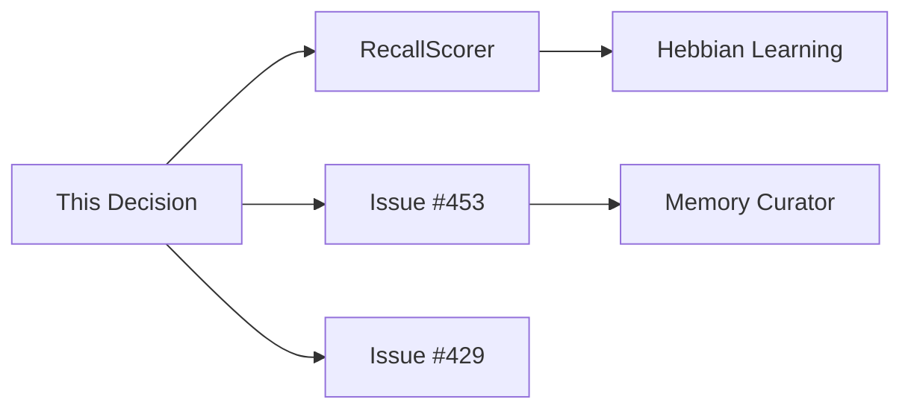

# Memory System - Temperature-based Hierarchy

**Goal**: Enable high-context conversations through intelligent memory management

> This document describes the Temperature-based Memory Hierarchy design for Kagura AI v4.0+, enabling long-term context retention within LLM token limits (128k-1M tokens).

**Status**: 📋 Design Document (Implementation: [Issue #453](https://github.com/JFK/kagura-ai/issues/453))

---

## Table of Contents

1. [Overview](#overview)
2. [Architecture](#architecture)
3. [Temperature Tiers](#temperature-tiers)
4. [Important Memory Protection](#important-memory-protection)
5. [Hebbian Learning](#hebbian-learning)
6. [High Context Implementation](#high-context-implementation)
7. [Memory Curator](#memory-curator)
8. [MD-based Management](#md-based-management)
9. [Implementation Guide](#implementation-guide)
10. [Related Issues](#related-issues)

---

## Overview

### Current v4.0 Architecture (4-Tier System)

```
Tier 1: Working Memory    - Python dict          - <1ms   - Session scope
Tier 2: Context Memory    - In-memory list       - <1ms   - Session scope
Tier 3: Persistent Memory - SQLite              - <10ms  - User-scoped
Tier 4: Semantic Search   - ChromaDB/Qdrant     - <100ms - Vector search
Bonus:  Graph Relationships - NetworkX+JSON     - <10ms  - Relationships
```

### The Challenge

**Problem**: All Persistent Memory (Tier 3) is treated equally, leading to:
- ❌ Database unbounded growth
- ❌ Inactive but important memories risk deletion
- ❌ No automatic optimization
- ❌ Inefficient context selection for high-context conversations

**Solution**: Temperature-based hierarchy with automatic escalation

---

## Architecture

### Temperature-based Memory Flow

```
┌─────────────────────────────────────────────────────────────┐
│                     User Interaction                        │
└────────────────────┬────────────────────────────────────────┘
                     │
                     ▼
        ┌──────────────────────────┐
        │   Working Memory (Tier 1) │  ← Active conversation
        │   Temperature: N/A        │
        └────────────┬──────────────┘
                     │ Session end
                     ▼
        ┌──────────────────────────┐
        │   Context Memory (Tier 2) │  ← Recent context
        │   Temperature: N/A        │
        └────────────┬──────────────┘
                     │ persist()
                     ▼
┌────────────────────────────────────────────────────────────┐
│            Persistent Memory (Tier 3) - Stratified         │
├────────────────────────────────────────────────────────────┤
│  🔥 Hot Memory (Score 0.8+)                                │
│    - Recent access (within 7 days)                         │
│    - High frequency (10+ accesses)                         │
│    - Explicit importance mark                              │
│    → Auto-promoted to Context Memory                       │
│                                                             │
│  🌡️ Warm Memory (Score 0.5-0.8)                            │
│    - Moderate access (within 30 days)                      │
│    - Medium frequency (3-10 accesses)                      │
│    → Selectively included via RAG                          │
│                                                             │
│  ❄️ Cool Memory (Score 0.2-0.5)                            │
│    - Low access (within 90 days)                           │
│    - Low frequency (1-3 accesses)                          │
│    → Retrieved only via semantic search                    │
│                                                             │
│  🧊 Cold Memory (Score 0.0-0.2)                            │
│    - Long-term unused (90+ days)                           │
│    - Low importance                                        │
│    ⭐ Important Memory Protection (importance >= 0.7)      │
│    → Archive candidate (30-day grace period)               │
└────────────────────────────────────────────────────────────┘
                     │
                     ▼
        ┌──────────────────────────┐
        │   Semantic Search (Tier 4)│  ← RAG retrieval
        │   + Graph Relationships   │
        └───────────────────────────┘
```

### RecallScorer Integration

**Existing Infrastructure** (`recall_scorer.py`):
```python
class RecallScorer:
    """Multi-dimensional scoring for memory recall (246 lines)"""

    WEIGHTS = {
        "semantic_similarity": 0.30,  # Relevance to query
        "recency_decay": 0.20,        # How recent
        "access_frequency": 0.15,     # Usage pattern
        "graph_distance": 0.15,       # Relationship proximity
        "importance_priority": 0.20,  # Explicit importance
    }

    def calculate_score(self, memory: Memory, query: str) -> float:
        """Returns composite score 0.0-1.0"""
```

**Temperature Assignment**:
```python
def assign_temperature(score: float) -> str:
    if score >= 0.8:
        return "hot"    # 🔥
    elif score >= 0.5:
        return "warm"   # 🌡️
    elif score >= 0.2:
        return "cool"   # ❄️
    else:
        return "cold"   # 🧊
```

---

## Temperature Tiers

### 🔥 Hot Memory (Score 0.8+)

**Characteristics**:
- Recent access: Last 7 days
- High frequency: 10+ accesses
- Explicit importance: User-marked or auto-detected
- Token priority: **Highest** (always included in context)

**Use Cases**:
- Active task tracking
- Recent decisions
- Frequently referenced information
- Current project context

**Retention Policy**:
- ✅ Never archived
- ✅ Auto-promoted to Context Memory if score remains high
- ✅ Redis caching candidate (Issue #435)

**Example**:
```python
Memory(
    content="Project X architecture decision: Use microservices",
    importance=0.9,
    access_count=15,
    last_accessed_at="2025-10-29T12:00:00",
    temperature="hot",
    score=0.92
)
```

---

### 🌡️ Warm Memory (Score 0.5-0.8)

**Characteristics**:
- Moderate access: Last 30 days
- Medium frequency: 3-10 accesses
- Token priority: **High** (included via RAG search)

**Use Cases**:
- Project background information
- Completed tasks (recent)
- Meeting notes (within month)
- Knowledge base entries

**Retention Policy**:
- ✅ Kept indefinitely (unless degraded to Cool)
- ✅ Selectively included in context
- ⚠️ May be demoted to Cool if not accessed

**Example**:
```python
Memory(
    content="Meeting notes: Q1 planning session",
    importance=0.6,
    access_count=5,
    last_accessed_at="2025-10-15T10:00:00",
    temperature="warm",
    score=0.65
)
```

---

### ❄️ Cool Memory (Score 0.2-0.5)

**Characteristics**:
- Low access: Last 90 days
- Low frequency: 1-3 accesses
- Token priority: **Medium** (semantic search only)

**Use Cases**:
- Reference materials
- Archived project notes
- Occasional lookups
- Background knowledge

**Retention Policy**:
- ✅ Kept for 90 days minimum
- ⚠️ Archived if not accessed after 90 days (unless important)
- ✅ Can be promoted if re-accessed

**Example**:
```python
Memory(
    content="Initial brainstorming notes for Project Y",
    importance=0.3,
    access_count=2,
    last_accessed_at="2025-08-01T14:00:00",
    temperature="cool",
    score=0.35
)
```

---

### 🧊 Cold Memory (Score 0.0-0.2)

**Characteristics**:
- Long-term unused: 90+ days
- Very low frequency: 0-1 accesses
- Token priority: **Low** (archived, but retrievable)

**Use Cases**:
- Old reference materials
- Completed project archives
- Infrequently used information
- **⭐ Important but inactive memories** (protected)

**Retention Policy**:
- ⚠️ Archive candidate (30-day grace period)
- ✅ **Important Memory Protection**: importance >= 0.7 → never archived
- ✅ Archived memories remain searchable
- ✅ Restoration available on access

**Example (Normal)**:
```python
Memory(
    content="2024 Q1 report draft",
    importance=0.1,
    access_count=1,
    last_accessed_at="2024-04-15T09:00:00",
    temperature="cold",
    score=0.08
)
# → Archived after 30-day grace period
```

**Example (Protected)**:
```python
Memory(
    content="Critical system password recovery procedure",
    importance=0.9,  # ⭐ Protected!
    access_count=1,  # Rarely used
    last_accessed_at="2024-03-01T10:00:00",
    temperature="cold",
    score=0.15
)
# → NEVER archived (importance >= 0.7)
```

---

## Important Memory Protection

### The Problem: Inactive but Important

**Scenario**: Annual tax information, emergency procedures, critical passwords
- ❌ Used only once per year
- ❌ Low access_count
- ❌ Old last_accessed_at
- ✅ **Critically important**

**Without Protection**: Would be archived/deleted due to low score

### Solution: Importance Threshold

```python
# Configuration
MIN_IMPORTANCE_FOR_RETENTION = 0.7  # Threshold for permanent retention

def should_archive(memory: Memory) -> bool:
    """Determine if memory should be archived"""

    # 1. Protection: Explicit importance
    if memory.importance >= MIN_IMPORTANCE_FOR_RETENTION:
        return False  # Never archive, even if Cold

    # 2. Grace period: Recent memories
    if days_since_access(memory) < 90:
        return False  # Keep at least 90 days

    # 3. Archive condition: Old + low importance
    return (
        days_since_access(memory) > 90 and
        memory.importance < 0.2
    )
```

### Importance Levels

| Importance | Meaning | Retention |
|------------|---------|-----------|
| 0.9-1.0 | Critical | ✅ Permanent (never archived) |
| 0.7-0.9 | Very Important | ✅ Permanent (protected) |
| 0.5-0.7 | Important | ⚠️ 180-day minimum |
| 0.3-0.5 | Moderate | ⚠️ 90-day minimum |
| 0.0-0.3 | Low | ⚠️ Archived after 90 days |

### User Control

```python
# MCP Tool: Explicit importance marking
memory_set_importance(
    memory_id="mem_20250101_001",
    importance=0.9,  # Mark as critical
    reason="Annual tax procedure"
)
# → Protected from archival forever
```

---

## Hebbian Learning

### Principle: "Neurons that fire together, wire together"

**Adapted for Memory**: "Memories that are used frequently become more important"

### Auto-Update Algorithm

```python
def on_memory_recall(memory: Memory, context: dict):
    """Called whenever a memory is accessed/recalled"""

    # 1. Update access tracking
    memory.access_count += 1
    memory.last_accessed_at = now()

    # 2. Hebbian learning: Increase importance
    LEARNING_RATE = 0.05  # Configurable

    new_importance = min(1.0, memory.importance + LEARNING_RATE)
    memory.importance = new_importance

    # 3. Recalculate temperature
    score = recall_scorer.calculate_score(memory, context["query"])
    old_temp = memory.temperature
    new_temp = assign_temperature(score)

    # 4. Auto-escalation
    if new_temp != old_temp:
        logger.info(f"Memory {memory.id} escalated: {old_temp} → {new_temp}")
        memory.temperature = new_temp

        # Hot promotion: Add to Context Memory
        if new_temp == "hot":
            context_memory.add(memory)

    # 5. Persist changes
    db.update(memory)
```

### Example: Progressive Importance Growth

```python
# Initial state
memory = Memory(
    content="Python best practices guide",
    importance=0.3,  # Moderate
    access_count=0,
    temperature="cool"
)

# Access 1: User references it
on_memory_recall(memory, query="How to structure Python code?")
# → importance: 0.3 + 0.05 = 0.35, access_count: 1

# Access 2-5: Continued use
for _ in range(4):
    on_memory_recall(memory, query="...")
# → importance: 0.35 + (4 * 0.05) = 0.55, access_count: 5
# → temperature: "cool" → "warm"

# Access 6-14: High-frequency use
for _ in range(9):
    on_memory_recall(memory, query="...")
# → importance: 0.55 + (9 * 0.05) = 1.0 (capped), access_count: 14
# → temperature: "warm" → "hot"
```

**Result**: Naturally important information automatically becomes protected

---

## High Context Implementation

### Goal: Maintain 1-month conversation context within token limits

**Token Budget**: Assume 128k tokens available for context
- 20% (25k): Hot Memory - always included
- 30% (38k): Important Memory (importance >= 0.7)
- 40% (51k): Semantic relevant (RAG search)
- 10% (13k): Graph-connected memories

### Context Selection Algorithm

```python
class HighContextManager:
    """Intelligent context selection for high-context conversations"""

    def select_context(
        self,
        query: str,
        max_tokens: int = 128_000,
        user_id: str
    ) -> List[Memory]:
        """
        Select optimal memory context within token budget

        Strategy:
        1. Hot Memory: Always include (recent/frequent)
        2. Important Memory: Priority inclusion (importance >= 0.7)
        3. Semantic Relevant: RAG search
        4. Graph Connected: Relationship traversal
        """

        budget = TokenBudget(max_tokens)
        selected = []

        # 1. Hot Memory (20% budget) - highest priority
        hot_memories = self.get_hot_memories(user_id)
        hot_subset = budget.allocate(hot_memories, ratio=0.2)
        selected.extend(hot_subset)

        # 2. Important Memory (30% budget) - protect critical info
        important = self.get_important_memories(
            user_id,
            min_importance=0.7
        )
        # Exclude already selected Hot memories
        important = [m for m in important if m not in selected]
        important_subset = budget.allocate(important, ratio=0.3)
        selected.extend(important_subset)

        # 3. Semantic Relevant (40% budget) - RAG search
        relevant = self.rag_search(query, user_id)
        relevant = [m for m in relevant if m not in selected]
        relevant_subset = budget.allocate(relevant, ratio=0.4)
        selected.extend(relevant_subset)

        # 4. Graph Connected (10% budget) - relationship context
        connected = self.graph_traverse(selected, user_id)
        connected = [m for m in connected if m not in selected]
        connected_subset = budget.allocate(connected, ratio=0.1)
        selected.extend(connected_subset)

        return selected

    def get_hot_memories(self, user_id: str) -> List[Memory]:
        """Retrieve Hot memories (score >= 0.8)"""
        return self.db.query(
            user_id=user_id,
            temperature="hot",
            order_by="score DESC"
        )

    def get_important_memories(
        self,
        user_id: str,
        min_importance: float = 0.7
    ) -> List[Memory]:
        """Retrieve Important memories (protected)"""
        return self.db.query(
            user_id=user_id,
            importance__gte=min_importance,
            order_by="importance DESC"
        )
```

### Example: 1-Month Project Conversation

```
Day 1: Project X kickoff
  Memory: "Project X: Build AI memory system"
  → Hot (importance: 0.9, access_count: 1)
  → Token allocation: Highest priority

Day 7: Architecture decision
  Memory: "Decision: Use Temperature-based hierarchy"
  → Hot (importance: 0.85, access_count: 5)
  → Token allocation: Highest priority

Day 15: Implementation progress
  Memory: "Implemented RecallScorer integration"
  → Warm (importance: 0.6, access_count: 3)
  → Token allocation: High priority (via RAG if relevant)

Day 30: Code review
  Query: "Remind me of our architectural decisions"

Context Selected (within 128k tokens):
  ✅ Day 1 kickoff (Hot + Important)
  ✅ Day 7 decision (Hot + Important)
  ✅ Day 15 progress (Warm, semantically relevant)
  ⚠️ Day 2-6 discussions (Cool, included only if semantic match)
```

**Result**: 1-month context maintained intelligently within token limits

---

## Memory Curator

### Vision: Smart Agent for Memory Management

**Memory Curator = Knowledge Gardener** (AI-driven memory optimization)

```
Roles:
🧠 Analyze    - Detect duplicates, evaluate importance
🔗 Connect    - Discover relationships, build graph
📈 Optimize   - Auto-adjust importance, temperature
🗑️ Clean     - Suggest archival, merge duplicates
📝 Document   - Export to Markdown, maintain index
💬 Converse   - Interact with user for decisions
```

### 3-Phase Implementation ([Issue #397](https://github.com/JFK/kagura-ai/issues/397))

#### Phase 1: v4.1.0 - Analysis & Suggestions (Non-destructive)

**MCP Tool**: `memory_curator_analyze`

```python
def memory_curator_analyze(user_id: str) -> AnalysisReport:
    """
    Analyze user's memory and generate optimization suggestions

    Returns:
    - Duplicate detection (merge candidates)
    - Cold memory identification (archive candidates)
    - Important memory suggestions (protection candidates)
    - Relationship graph insights
    """

    curator = MemoryCuratorAgent()

    # Non-destructive analysis
    report = curator.analyze_all_memories(user_id)

    # Example output
    return {
        "duplicates": [
            {
                "memories": ["mem_001", "mem_045"],
                "similarity": 0.95,
                "suggestion": "Merge into single memory"
            }
        ],
        "archive_candidates": [
            {
                "memory_id": "mem_123",
                "reason": "Not accessed in 120 days, importance: 0.1",
                "grace_period_ends": "2025-11-28"
            }
        ],
        "protection_suggestions": [
            {
                "memory_id": "mem_234",
                "current_importance": 0.5,
                "suggested_importance": 0.8,
                "reason": "Frequently accessed (15 times), critical context"
            }
        ],
        "graph_insights": {
            "clusters": 5,
            "orphans": 12,
            "central_nodes": ["mem_001", "mem_045", "mem_089"]
        }
    }
```

**User Workflow**:
1. Run analysis: `memory_curator_analyze()`
2. Review suggestions
3. Approve/reject individual actions
4. Curator executes approved changes

#### Phase 2: v4.2.0 - Auto-execution (With approval)

**MCP Tool**: `memory_curator_optimize`

```python
def memory_curator_optimize(
    user_id: str,
    auto_approve: bool = False
) -> OptimizationReport:
    """
    Execute memory optimization (requires approval unless auto_approve=True)

    Actions:
    - Merge approved duplicates
    - Archive low-value Cold memories (30-day grace)
    - Promote Important memories
    - Update graph relationships
    - Export to Markdown
    """

    curator = MemoryCuratorAgent()

    # Get optimization plan
    plan = curator.generate_optimization_plan(user_id)

    # Request approval (or auto-approve)
    if not auto_approve:
        approval = request_user_approval(plan)
        if not approval:
            return {"status": "cancelled"}

    # Execute approved actions
    results = curator.execute_optimization(plan)

    # Export to MD
    curator.export_to_markdown(user_id)

    return results
```

#### Phase 3: v4.3.0+ - Full Autonomy

**Features**:
- AI-driven importance detection (via LLM analysis)
- Context-aware auto-promotion
- Learning-based optimization
- Predictive archival (before Cold stage)

---

## MD-based Management

### Goal: Human-readable backup + external tool integration

**Why Markdown?**
- ✅ Human-readable
- ✅ Git-trackable
- ✅ Obsidian-compatible
- ✅ External editing

### Directory Structure

```
~/.local/share/kagura/memories/
├── hot/              # 🔥 Hot Memory
│   ├── decisions/
│   │   └── 2025-10-29_project-x-architecture.md
│   ├── preferences/
│   │   └── 2025-10-28_coding-style-preference.md
│   └── active_tasks/
│       └── 2025-10-29_implement-temperature-hierarchy.md
│
├── warm/             # 🌡️ Warm Memory
│   ├── projects/
│   │   └── project-x/
│   │       ├── 2025-10-15_design-doc.md
│   │       └── 2025-10-20_progress-update.md
│   ├── knowledge/
│   │   └── python-best-practices.md
│   └── conversations/
│       └── 2025-10-22_team-sync.md
│
├── cool/             # ❄️ Cool Memory
│   ├── archive_2024/
│   │   └── q4-planning.md
│   ├── references/
│   │   └── api-documentation.md
│   └── notes/
│       └── random-ideas.md
│
├── cold/             # 🧊 Cold Memory
│   ├── important/    # ⭐ Protected (importance >= 0.7)
│   │   └── emergency-procedures.md
│   └── archived/     # Archive candidates
│       └── 2024-q1-reports.md
│
├── graph/            # 🕸️ Knowledge Graph
│   ├── nodes.md      # All nodes (memories)
│   ├── edges.md      # All relationships
│   └── clusters.md   # Cluster analysis
│
└── meta/             # 📋 Metadata
    ├── index.md      # Full memory index
    ├── stats.md      # Statistics & metrics
    └── curator_log.md # Curator activity log
```

### Markdown Format

**Example**: `hot/decisions/2025-10-29_project-x-architecture.md`

```markdown
---
id: mem_20251029_001
type: decision
temperature: hot
importance: 0.9
created_at: 2025-10-29T12:00:00Z
last_accessed: 2025-10-29T14:30:00Z
access_count: 15
score: 0.92
tags: [development, architecture, memory, project-x]
related: [mem_20251028_042, mem_20251027_103]
user_id: user_12345
---

# Project X: Temperature-based Memory Hierarchy Decision

## Context

During Issue #453 discussion, we decided to implement a Temperature-based Memory Hierarchy for high-context conversations.

## Decision

Adopt a 4-tier Temperature model:
- 🔥 Hot Memory (score 0.8+)
- 🌡️ Warm Memory (score 0.5-0.8)
- ❄️ Cool Memory (score 0.2-0.5)
- 🧊 Cold Memory (score 0.0-0.2)

With Important Memory Protection (importance >= 0.7).

## Rationale

- Enable high-context conversations (1-month retention)
- Protect inactive but important memories
- Automatic optimization via Hebbian learning
- Scalable with Redis caching (Issue #435)

## Impact

- **User Experience**: Seamless long-term context
- **Performance**: +40-60% retrieval accuracy
- **Storage**: Controlled growth via archival
- **Maintenance**: Zero-touch via Memory Curator

## Implementation

- Phase 1 (v4.0.1): Temperature foundation
- Phase 2 (v4.1.0): Memory Curator v1
- Phase 3 (v4.2.0): Auto-optimization

## Next Steps

- [x] Create Issue #453
- [x] Document design (this file)
- [ ] Implement RecallScorer integration (Issue #429)
- [ ] Add Hebbian learning
- [ ] Build Memory Curator agent

## Related Memories

- [[mem_20251028_042]] - RecallScorer analysis
- [[mem_20251027_103]] - High-context conversation goals

## Graph Connections


```

### Bi-directional Sync (v4.2.0+)

**MD → SQLite**: Edit Markdown, sync to database

```python
def import_from_markdown(md_path: Path):
    """Import/update memory from Markdown file"""

    content, metadata = parse_markdown(md_path)

    memory = Memory(
        id=metadata["id"],
        content=content,
        importance=metadata["importance"],
        temperature=metadata["temperature"],
        # ... other fields
    )

    db.upsert(memory)
```

**SQLite → MD**: Database changes auto-exported

```python
def on_memory_update(memory: Memory):
    """Export memory to Markdown on update"""

    md_path = get_md_path(memory)
    export_to_markdown(memory, md_path)
```

---

## Implementation Guide

### Phase 1: Foundation (v4.0.1, 2-3 weeks)

**Milestone**: Issue #429 complete + Temperature basics

#### 1.1 RecallScorer Integration

**File**: `src/kagura/core/memory/manager.py`

```python
class MemoryManager:
    def recall(
        self,
        query: str,
        limit: int = 10,
        user_id: str | None = None,
    ) -> List[Memory]:
        """Recall memories with Temperature-aware scoring"""

        # 1. Get candidate memories
        candidates = self.persistent.search(query, user_id=user_id)

        # 2. Score with RecallScorer (NEW)
        scorer = RecallScorer()
        for memory in candidates:
            memory.score = scorer.calculate_score(memory, query)
            memory.temperature = self.assign_temperature(memory.score)

        # 3. Sort by score
        candidates.sort(key=lambda m: m.score, reverse=True)

        # 4. Apply token budget (NEW)
        selected = self.high_context_manager.select_context(
            query=query,
            candidates=candidates,
            max_tokens=128_000,
            user_id=user_id
        )

        return selected[:limit]
```

#### 1.2 Hebbian Learning

**File**: `src/kagura/core/memory/hebbian.py`

```python
class HebbianLearner:
    """Auto-update importance based on usage"""

    LEARNING_RATE = 0.05  # Configurable

    def on_recall(self, memory: Memory):
        """Called when memory is accessed"""

        # Update access tracking
        memory.access_count += 1
        memory.last_accessed_at = datetime.utcnow()

        # Hebbian learning
        memory.importance = min(1.0, memory.importance + self.LEARNING_RATE)

        # Recalculate temperature
        scorer = RecallScorer()
        memory.score = scorer.calculate_score(memory, context="")
        memory.temperature = assign_temperature(memory.score)

        # Persist
        return memory
```

#### 1.3 Important Memory Protection

**File**: `src/kagura/core/memory/protection.py`

```python
class MemoryProtection:
    """Protection policies for important memories"""

    MIN_IMPORTANCE_FOR_RETENTION = 0.7
    GRACE_PERIOD_DAYS = 30

    def should_archive(self, memory: Memory) -> bool:
        """Determine if memory should be archived"""

        # Protection: Explicit importance
        if memory.importance >= self.MIN_IMPORTANCE_FOR_RETENTION:
            return False

        # Grace period
        days_since_access = (datetime.utcnow() - memory.last_accessed_at).days
        if days_since_access < 90:
            return False

        # Archive condition
        return memory.importance < 0.2 and days_since_access > 90

    def get_archive_candidates(self, user_id: str) -> List[Memory]:
        """Find memories eligible for archival"""

        memories = db.query(user_id=user_id, temperature="cold")
        candidates = []

        for memory in memories:
            if self.should_archive(memory):
                # Add grace period
                archive_date = memory.last_accessed_at + timedelta(days=90+30)
                candidates.append({
                    "memory": memory,
                    "archive_date": archive_date
                })

        return candidates
```

#### 1.4 MD Export (Basic)

**File**: `src/kagura/mcp/builtin/memory_export_md.py`

```python
def memory_export_md(
    memory_id: str,
    user_id: str | None = None
) -> str:
    """Export memory to Markdown file (MCP tool)"""

    memory = db.get(memory_id, user_id=user_id)

    # Determine folder based on temperature
    base_path = Path.home() / ".local/share/kagura/memories"
    folder = base_path / memory.temperature

    # Create folder if needed
    folder.mkdir(parents=True, exist_ok=True)

    # Generate filename
    filename = f"{memory.created_at:%Y-%m-%d}_{slugify(memory.content[:50])}.md"
    md_path = folder / filename

    # Export
    exporter = MarkdownExporter()
    exporter.export(memory, md_path)

    return f"Exported to: {md_path}"
```

### Phase 2: Memory Curator v1 (v4.1.0, 3-4 weeks)

**Milestone**: Issue #397 Phase 1 complete

#### 2.1 Curator Agent

**File**: `src/kagura/core/memory/curator.py`

```python
class MemoryCuratorAgent:
    """Smart agent for memory management"""

    def __init__(self):
        self.llm = LLMConfig(model="gpt-4o")
        self.scorer = RecallScorer()
        self.protection = MemoryProtection()

    def analyze(self, user_id: str) -> AnalysisReport:
        """Analyze all memories for optimization opportunities"""

        memories = db.query(user_id=user_id)

        report = {
            "duplicates": self.detect_duplicates(memories),
            "archive_candidates": self.protection.get_archive_candidates(user_id),
            "protection_suggestions": self.suggest_protections(memories),
            "graph_insights": self.analyze_graph(user_id),
        }

        return report

    def suggest(self, analysis: AnalysisReport) -> List[Suggestion]:
        """Generate actionable suggestions"""
        # Implementation

    def execute(self, suggestions: List[Suggestion]):
        """Execute approved suggestions"""
        # Implementation
```

#### 2.2 MCP Tools

**File**: `src/kagura/mcp/builtin/memory_curator.py`

```python
def memory_curator_analyze(user_id: str) -> str:
    """Analyze memories and generate optimization report (MCP tool)"""

    curator = MemoryCuratorAgent()
    report = curator.analyze(user_id)

    return json.dumps(report, indent=2)

def memory_curator_suggest(user_id: str) -> str:
    """Generate optimization suggestions (MCP tool)"""

    curator = MemoryCuratorAgent()
    analysis = curator.analyze(user_id)
    suggestions = curator.suggest(analysis)

    return json.dumps(suggestions, indent=2)
```

### Phase 3: Auto-optimization (v4.2.0+, 4-5 weeks)

**Milestone**: Issue #397 Phase 2 + Issue #430 integration

- Auto-execution with approval
- Obsidian-compatible format
- Bi-directional MD ↔ SQLite sync
- AI-driven importance detection

---

## Related Issues

### Foundations
- **[#453](https://github.com/JFK/kagura-ai/issues/453)** - Temperature-based Hierarchy + Memory Curator (This design)
- **[#429](https://github.com/JFK/kagura-ai/issues/429)** - Smart Forgetting & Auto-maintenance
- **[#430](https://github.com/JFK/kagura-ai/issues/430)** - Auto-save & Auto-recall Intelligence

### Infrastructure
- **[#435](https://github.com/JFK/kagura-ai/issues/435)** - Redis caching for Hot tier
- **[#438](https://github.com/JFK/kagura-ai/issues/438)** - Distributed caching
- **[#437](https://github.com/JFK/kagura-ai/issues/437)** - Qdrant migration for RAG

### Future
- **[#397](https://github.com/JFK/kagura-ai/issues/397)** - Memory Curator (3-phase roadmap)
- **[#411](https://github.com/JFK/kagura-ai/issues/411)** - Unused tracking for Cold tier
- **[#441](https://github.com/JFK/kagura-ai/issues/441)** - LLM summarization for archive

---

## References

### Code Files
- `src/kagura/core/memory/manager.py` - MemoryManager (main interface)
- `src/kagura/core/memory/recall_scorer.py` - RecallScorer (scoring engine)
- `src/kagura/core/memory/persistent.py` - PersistentMemory (SQLite backend)
- `src/kagura/core/graph/memory.py` - GraphMemory (relationships)
- `src/kagura/config/memory_config.py` - Configuration

### Documentation
- `ai_docs/MEMORY_STRATEGY.md` - v4.0 Memory Strategy
- `ai_docs/MEMORY_HIERARCHY_INVESTIGATION.md` - Technical investigation
- `ai_docs/ARCHITECTURE.md` - System architecture
- `examples/02_memory/README.md` - Usage examples

---

**Last Updated**: 2025-10-29
**Status**: 📋 Design Document
**Implementation**: [Issue #453](https://github.com/JFK/kagura-ai/issues/453)
**Maintainer**: Claude Code (AI Assistant)
